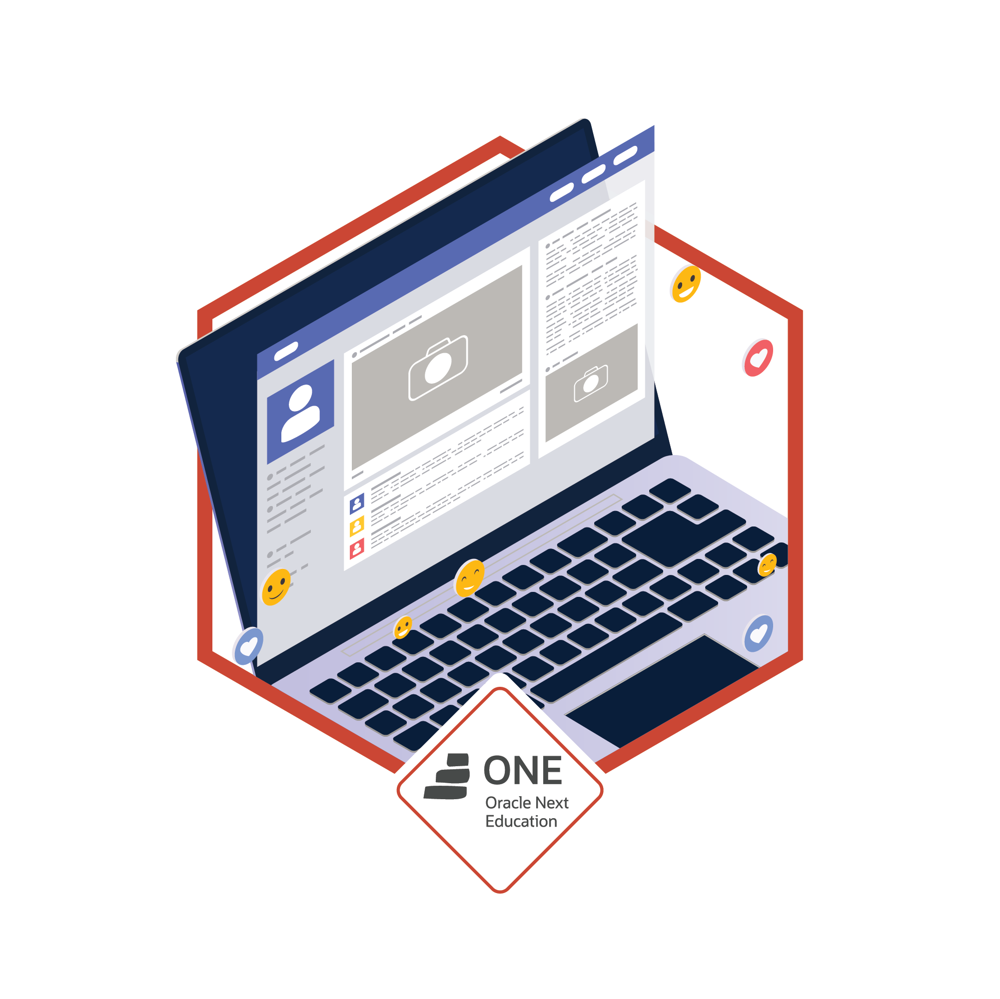

# Portfolio 💼

Portfolio personal desarrollado como parte del Challenge Front End.

---

## 📄 Requisitos cumplidos

- Menú de navegación responsive (desplegable al hacer clic en el título en móvil/tablet).
- Imagen de banner y foto de perfil.
- Sección "Sobre mí" con datos personales:
  - Nombre
  - Edad
  - Nacionalidad
  - Biografía
- Enlaces a redes sociales.
- Sección de Hobbies y Soft Skills.
- Sección de formación y cursos.
- Sección de experiencia/proyectos realizados.
- Formulario de contacto con validaciones:
  - Nombre y Asunto: no vacíos, máximo 50 caracteres.
  - Email: formato válido.
  - Mensaje: no vacío, máximo 300 caracteres.
  - Botón enviar solo habilitado si el formulario es válido.
- Pie de página con información y año actual.
- Diseño 100% responsivo para desktop, tablet y móvil.

---

## ✍️ Extras implementados

- Botón para ver el CV en PDF (si está disponible).
- Validaciones de formulario con mensajes de error específicos.
- El menú de navegación se despliega al hacer clic en el título del sitio en pantallas pequeñas.
- Código y estilos optimizados, sin elementos innecesarios.
- Imágenes y recursos organizados.

---

## 🔋 Recursos y Materiales recomendados

- [CSS3 - Primera página Web](https://www.aluracursos.com/curso-online-html5-css3-primera-pagina-web)
- [CSS3 - Posicionamiento](https://www.aluracursos.com/curso-online-html5-css3-posicionamiento-listas-navegacion)
- [CSS3 - Formularios y Tablas](https://www.aluracursos.com/curso-online-html5-css3-formularios-tablas)
- [CSS3 - HTML5/CSS3 avanzado](https://www.aluracursos.com/curso-online-html5-css3-avanzando-css)
- [CSS3 - Diseño inclusivo](https://www.aluracursos.com/curso-online-accesibilidad-web-introduccion-diseno-inclusivo)
- [CSS3 - Arquitectura](https://app.aluracursos.com/course/arquitectura-css-descomplicando-problemas)
- [CSS3 - Flexbox](https://www.aluracursos.com/curso-online-flexbox-posicione-elementos-pantalla)
- [CSS3 - Grid](https://www.aluracursos.com/curso-online-css-grid-simplificando-layouts)
- [CSS3 - Layout responsivo](https://www.aluracursos.com/curso-online-layouts-responsivos-layouts-mobile)

---

## 😊 Insignia de finalización Sprint

